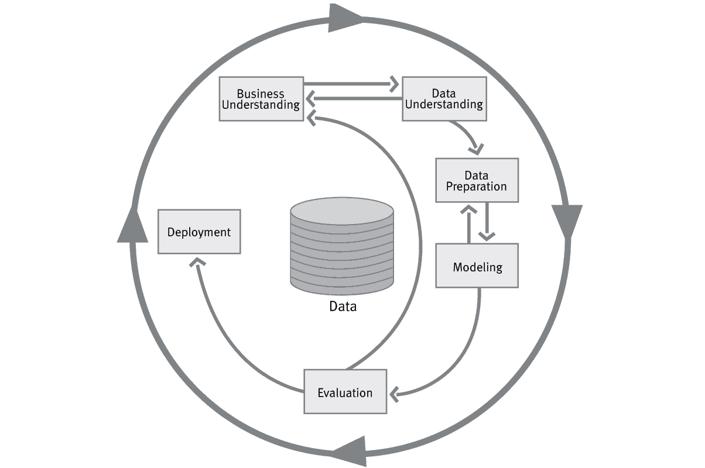

# 🍽️ Straining the Great Southern Melting Pot

Analysis of 53,566 restaurant reviews from Atlanta (USA) using Text Mining techniques to classify cuisine types and evaluate the relationship between review polarity and rating.

---

## 🎯 Project Objective

This project aims to apply text mining techniques to address the following information requirements:

- **Multilabel Classification**: Classify a restaurant's cuisine type based on the content of its reviews.
- **Sentiment Analysis**: Evaluate the relationship between the polarity of a review and its assigned rating.
- **(Optional)** Additional requirement defined by the group, such as co-occurrence analysis or topic modeling.

---

## 📁 Repository Structure

```tree
├── data/
│   └── atlanta_restaurant_slice_2023.csv
├── notebooks/
│   ├── exploration.ipynb
│   └── XXX.ipynb
├── source/
│   ├── utils.py
│   └── XXX.py
├── report/
│   └── final_report.pdf
├── README.md
└── requirements.txt
```

---

## 👥 Team

- Beatriz Marques 20231605  
- David Carrilho 20231693  
- Duarte Fernandes 20231619  
- Filipe Caçador 20231707  
- Mariana Calais-Pedro 20231641

---

## 🧠 Technologies Used

XXXXX

---

## 📊 Methodology

The project follows the **CRISP-DM** process model, consisting of the following phases:

1. **Data Understanding**  
2. **Data Preparation**  
3. **Modeling**  
4. **Evaluation**  
5. **Deployment**



---

## ⚙️ How to Run

```bash
# Clone the repository
git clone https://github.com/FHunter2005/Text_Mining---Atlanta_Reviews.git

# Install dependencies
pip install -r requirements.txt

# Run the notebook
jupyter notebook notebooks/main_notebook.ipynb
```

## 🧪 Git Workflow Guide

Follow these steps to collaborate smoothly with your team:

---

### 🔀 Step 1: Check your current branch

Before you start working, verify which branch you're on:

```bash
git branch
```
If you're already on your personal branch, proceed to Step 2. If not, switch to your branch:

```bash
git checkout your-branch-name
```
### 🔄 Step 2: Sync with the shared branch
Before you start working, pull the latest changes from the shared branch:
```bash
git pull origin shared-branch-name
```
Now you're ready to work!

### 💾 Step 3: Save and push your changes
When you're done working:
```bash
git add .
git commit -m "descriptive commit message"
git push origin your-branch-name
```
### 🔁 Step 4: Update the shared branch
After pushing your changes, merge them into the shared branch:
```bash
git checkout shared-branch-name
git pull origin shared-branch-name
git merge your-branch-name
```